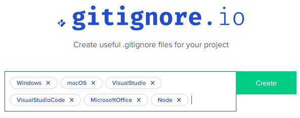
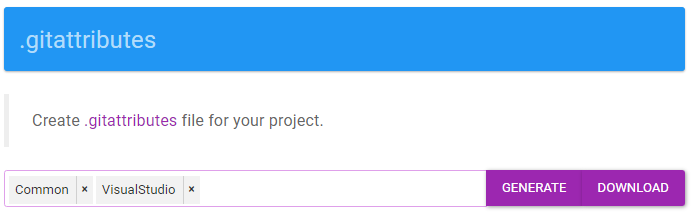

# Agenda - A01

<!-- ## Sep 27

- LINQ Method Syntax
- Aggregate Methods with LINQ

## W04-D2

- **Wed, Oct 6** - (Tentative) Date for first In-Class Assessment (on LINQ)
- Answers to LINQ Practice Questions
- Setup Take-Home Exercises Repo
  - [.gitignore](https://gitignore.io)

    

  - [.gitattributes](https://gitattributes.io)

    

  - Issue #1: First Exercise - LINQ
    - Do: Wed, Sept 29, 2021
    - Due: Mon, Oct 4, 2021

## Oct 1

- **Friday, Oct 8** - First In-Class Assessment (on LINQ)
- Today's Class - *Lab time for LINQ Take-Home* - due by Wed, Oct 6 class.
- Next Week - Intro to ASP.NET Core

## Oct 4

- LINQ Q & A
- Lesson 020 Series - **Intro to ASP.NET Core**

## Oct 13 - Lesson 020 Series

- **021** Getting Serious about OOP
  - `record` types in C# 9
  - Dependency Injection - *Nothing `new` Here!*
    - Minimize Dependencies, Rely on abstractions

## Oct 15 - Lesson 020 Series

- **021** More Environment Information
  - Database Type and Connection Information
  - Web Server type, content path & application path
    - Upload a File (`Resume`)

## Oct 18/20/22 - Lesson 020 Series

- **022** CRUD with Internal Entities
  - Sandbox - Capstone Students
  - WestWind - **Practice/Homework**
  - [12 minute Video](https://www.youtube.com/watch?v=qpH7-KFWZRI&list=PLWtPDlPVWF-9AmUZ49tWVtF3sF8guC5Xj&index=19) - **Prep Next Class**

## Oct 25

- **023** Queries and HTML Tables

-->

## Nov 1

- **024** Bulk Editing

