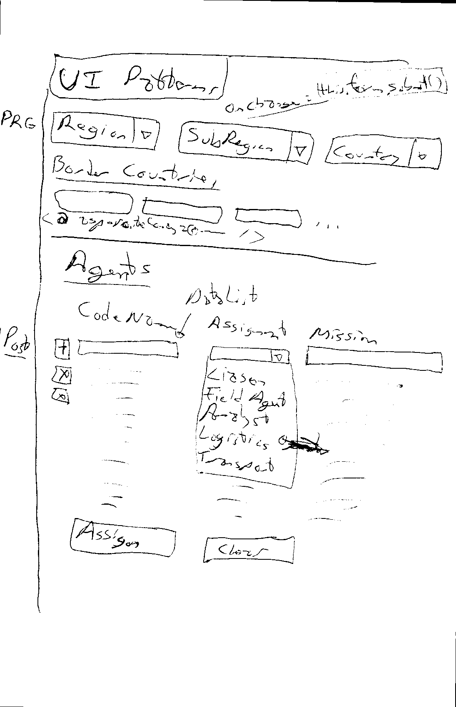

# Agenda - A01

<!-- ## Sep 27

- LINQ Method Syntax
- Aggregate Methods with LINQ

## W04-D2

- **Wed, Oct 6** - (Tentative) Date for first In-Class Assessment (on LINQ)
- Answers to LINQ Practice Questions
- Setup Take-Home Exercises Repo
  - [.gitignore](https://gitignore.io)

    

  - [.gitattributes](https://gitattributes.io)

    

  - Issue #1: First Exercise - LINQ
    - Do: Wed, Sept 29, 2021
    - Due: Mon, Oct 4, 2021

## Oct 1

- **Friday, Oct 8** - First In-Class Assessment (on LINQ)
- Today's Class - *Lab time for LINQ Take-Home* - due by Wed, Oct 6 class.
- Next Week - Intro to ASP.NET Core

## Oct 4

- LINQ Q & A
- Lesson 020 Series - **Intro to ASP.NET Core**

## Oct 13 - Lesson 020 Series

- **021** Getting Serious about OOP
  - `record` types in C# 9
  - Dependency Injection - *Nothing `new` Here!*
    - Minimize Dependencies, Rely on abstractions

## Oct 15 - Lesson 020 Series

- **021** More Environment Information
  - Database Type and Connection Information
  - Web Server type, content path & application path
    - Upload a File (`Resume`)

## Oct 18/20/22 - Lesson 020 Series

- **022** CRUD with Internal Entities
  - Sandbox - Capstone Students
  - WestWind - **Practice/Homework**
  - [12 minute Video](https://www.youtube.com/watch?v=qpH7-KFWZRI&list=PLWtPDlPVWF-9AmUZ49tWVtF3sF8guC5Xj&index=19) - **Prep Next Class**

## Oct 25

- **023** Queries and HTML Tables

-->
<!--
## Nove 1

- **024** Bulk Editing

-->

<!-- copy/paste
Watch the following video and add timestamps and titles for when topics change. Include at least 6 topic changes including the intro, agenda (if present), and outro. Send me the information in the following format.

[0:00] - Intro
[mm:ss] - Agenda (if present)
[mm:ss] - Title for topic
[mm:ss] - Title for topic
[hh:mm:ss] - Title for topic
[hh:mm:ss] - Outro

Video_Link
-->

## *Easy Bonus Marks*

Watch the following video and add timestamps and titles for when topics change. Include at least 6 topic changes including the intro, agenda (if present), and outro. Send me the information in the following format.

- [0:00] - Intro
- [mm:ss] - Agenda (if present)
- [mm:ss] - Title for topic
- [mm:ss] - Title for topic
- [hh:mm:ss] - Title for topic
- [hh:mm:ss] - Title for topic
- [hh:mm:ss] - Outro

Video_Link

## Nov 26

- **Take-Home #3 - Implementation Planning**
  - Preview assignment - out today
- **UI Patterns for Razor Page Data Entry**
  - POST vs GET vs PRG (*Post-Redirect-Get*)
  - When to use Post-Redirect-Get (drill-in with routing parameters *vs.* back-end data storage via BLL)
  - When ***not*** to use Post-Redirect-Get
  - Multiple Routing Parameters
  - Cascading Drop-Downs (with automatic post-back `onchange`)
  - Using enumerations in drop-downs
  - Links with `asp-route`*`ParameterName`*`=`
  - Using `Dictionary<TKey, TValue>` objects

  

