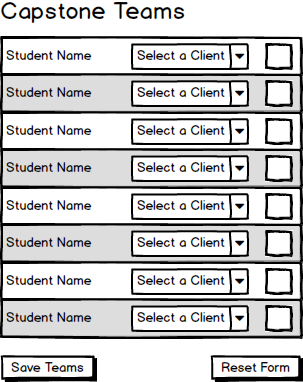

# Capstone 2019

Create an app that allows setting up teams for Capstone 2019. Use the accompanying database project to create the database, and build a form to bulk-edit the creation of the teams.


## Business Rules

- The smallest team size is four students
- The largest team size is seven students
- Clients with more than seven students must be broken into separate teams, each with a team letter (starting with 'A').
- Only assign students to clients that have been confirmed as participating.



The following `ClientInfo` record type is focused on identifying clients in a drop-down (i.e.: `<select>`). It fulfills a *query* responsibility.

```cs
public record ClientInfo(int ClientId, string Company)
{
    public ClientInfo() : this(0, null) {}
}
```

The following `StudentAssignment` record type serves to fulfill a *query* and a *command* responsibility. Technically, the only portions needed for a command are the `StudentId`, `ClientId` and `TeamLetter` portions, but creating a separate record type when the only difference is the `FullName` is unnecessary.

```cs
public record StudentAssignment(int StudentId, string FullName, int? ClientId, string TeamLetter)
{
    public StudentAssignment() : this(0, 0, null) {}
}
```

